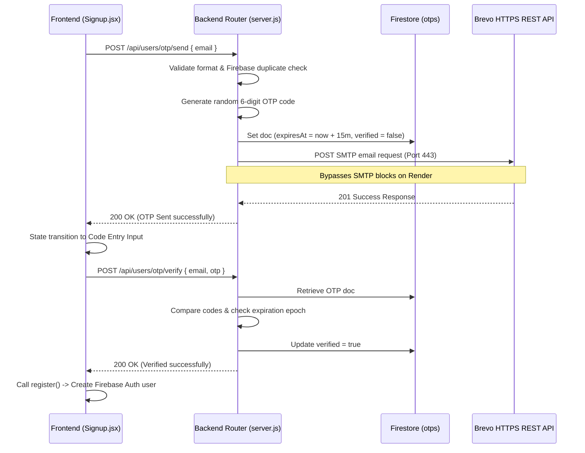

# 🧭 PathFinder AI - Software Architecture & Technical Specification

This document serves as a master technical specification for **PathFinder AI**. It is designed to act as a highly rich, comprehensive context injector for any developer or AI model tasked with writing documentation, refactoring, or expanding the codebase.

---

## 🛠️ 1. Complete Technology Stack

### A. Frontend Architecture
* **Core Library:** React.js (Vite bundle runner)
* **Routing:** `react-router-dom` (Protected routes via dynamic authentication guards, MainLayout and Index landing views).
* **Styling System:**
  * **Tailwind CSS:** Responsive grid layouts, sizing, color variants, dark mode classes.
  * **Custom CSS (index.css):** Custom scrollbars, `@keyframes` slow-moving animated background gradients, glassmorphism overlays, custom layouts, and a custom tooltip system.
* **Vector Graphics:** `lucide-react` for responsive icon packs.
* **Animations:** `react-countup` and `react-intersection-observer` for scroll-triggered visual numbers.
* **Internationalization & RTL Support:** `i18next` with RTL/LTR directional selectors supporting multiple languages.
* **HTTP Client:** `axios` with an interceptor base URL linking to the Render-hosted backend.

### B. Backend Architecture
* **Server Framework:** Node.js with Express.js.
* **Database Management:** Firebase Firestore (integrated via `firebase-admin` SDK) + MongoDB Mongoose schemas for additional user modeling.
* **Authentication:** Firebase Auth (Client generates dynamic ID tokens, Backend intercepts headers and validates them using the Firebase Admin SDK).
* **SMTP & Email Dispatch:** Brevo (Sendinblue) HTTPS REST API (utilizing Axios over Secure Port 443 with a fallback logs bypass).
* **AI Provider client:** Groq API Client and OpenRouter integrations for advanced LLM text completions.
* **Cron & Background Workers:** Custom interval loop in Express (`deadlineWorker.js`) for upcoming goal deadlines.

---

## 📁 2. Workspace Directory Structure

### A. Frontend Layout (`/frontend`)
* `/public`: Static landing page media and icons.
* `/src`:
  * `/components`: Base page containers (`MainLayout.jsx` dashboard frame, authentication protectors).
  * `/contexts`: React Auth Context (`AuthContext.jsx`) managing login session states and profile caches.
  * `/pages`:
    * `Index.jsx`: High-end landing page containing custom scroll animations, FAQ panels, and responsive drawers.
    * `Signup.jsx` & `Login.jsx`: 2-step OTP registration screen and session login portals.
    * `Dashboard.jsx` & `Profile.jsx`: User progress overviews, milestone badges, and profile editing.
    * `Interview.jsx`: Groq-powered chat interface with interactive sessions and sliding historical logs.
    * `Goals.jsx` & `Progress.jsx`: CRUD goal managers and visual KPI counters.
    * `CVBuilder.jsx`: Resume builder panel.
    * `Jobsearch.jsx` & `CareerPaths.jsx`: AI job searches and curated industry paths.
    * `/services`: Axios instance config linking to Render APIs.

### B. Backend Layout (`/backend`)
* `server.js`: Express listener, rate-limit initializers, worker scheduler, and middleware routers.
* `/config`: Database connections and API setups (`db.js`, `openrouter.js`).
* `/middleware`: Header decoders (`protect` Firebase tokens) and custom standard `errorHandler.js`.
* `/utils`: Modular libraries (`emailService.js` utilizing Brevo API, `aiProviderClient.js`).
* `/workers`: Automated cron listeners (`deadlineWorker.js`).
* `/modules`: Encapsulated routers, controllers, and services grouped by domain:
  * `/users`: Signup verification, Firebase Profile DB synchronization, reset-data tools.
  * `/goals`: CRUD goals controllers.
  * `/interview`: Interactive sessions manager.
  * `/recommendations` & `/jobs`: Groq recommendation pathways.
  * `/community` & `/notifications`: Discussions lists and unread badge managers.

---

## 🗄️ 3. Database Architecture & Firestore Schemas

All core collections are stored dynamically within **Google Firestore**:

### A. Collection: `users` (Doc ID = User UID)
Represents the detailed profile of the student or career tracker:
* `name` (String): Full name.
* `email` (String): Email address.
* `phone` (String): Contact number.
* `location` (String): City/Country.
* `education` (String): Educational history.
* `experience` (String): Career experience details.
* `skills` (Array of Strings): Interactive skill capsules.
* `interests` (Array of Strings): Capsule-based career interests.
* `careerGoals` (Array of Strings): target paths.
* `createdAt` (Timestamp): Creation time.

### B. Collection: `otps` (Doc ID = Email)
Saves OTP status for signup validation:
* `email` (String): Signup target email.
* `otp` (String): Generated 6-digit random code.
* `expiresAt` (Number): 15-minute epoch timestamp.
* `verified` (Boolean): Verification check.
* `createdAt` (ServerTimestamp): Timestamp.

### C. Collection: `goals` (Auto-generated Doc ID)
Tracks milestones set by the user:
* `userId` (String): Reference to Owner UID.
* `text` (String): Description of the goal.
* `category` (String): e.g. "Career", "Skill".
* `priority` (String): e.g. "high", "medium", "low".
* `deadline` (String): Selected target date.
* `completed` (Boolean): Toggle indicator.
* `progress` (Number): Percentage completions.

### D. Collection: `chats` (Auto-generated Doc ID)
Archives historical conversations:
* `userId` (String): Owner UID.
* `sessionId` (String): Unique session ID.
* `messages` (Array of Objects): e.g., `[{ role: "user", content: "...", timestamp: "..." }]`.

---

## 🔄 4. Core System Interactions & Data Flows

### A. The 2-Step OTP Signup Flow


### B. Background Deadline Notification Loop
```mermaid
chronology
    Interval trigger in deadlineWorker.js (Every 24 Hours)
    Worker scans Firestore collection: "goals" where completed = false
    Checks if difference between "deadline" and "now" is exactly 24 Hours
    Goal matches deadline alert
    Worker creates a document in collection "notifications" with user UID
    Dashboard navbar retrieves unread counts via dynamic GET notifications
    Increment badge count in Frontend Navbar Alert icon
```

---

## 🌐 5. Backend REST API Directory

All endpoints are prefixed with `/api` and require a dynamic Bearer ID token in the authorization header (except public OTP endpoints):

| Route Path | Method | Auth | Description |
| :--- | :--- | :--- | :--- |
| `/users/otp/send` | `POST` | Public | Dispatches OTP code via Brevo HTTPS API |
| `/users/otp/verify` | `POST` | Public | Validates verification code against database |
| `/users/register` | `POST` | Protected | Synchronizes Firebase profile document creation |
| `/users/login` | `POST` | Protected | Logs in user and cache session profiles |
| `/users/profile` | `GET` | Protected | Retrieves authenticated user Firestore profile |
| `/users/profile` | `PATCH` | Protected | Performs delta updates to profiles (skills, etc.) |
| `/goals` | `POST` | Protected | Creates a new user goal |
| `/goals` | `GET` | Protected | Lists goals belonging to authenticated owner |
| `/goals/:id` | `PATCH` | Protected | Modifies completion states and progress percentages |
| `/goals/:id` | `DELETE` | Protected | Permanently purges a goal |
| `/interview/chat` | `POST` | Protected | Starts or streams completion chats with Groq AI |
| `/notifications` | `GET` | Protected | Returns list of deadlines and badge counts |

---

## 🎨 6. Premium UI Aesthetics & Theme System

### A. Slow-Moving Background Gradient (index.css)
* The entire background animation is defined at the `body` level using standard CSS transitions.
* **CSS Implementation:**
  ```css
  @keyframes premium-gradient {
    0% { background-position: 0% 50%; }
    50% { background-position: 100% 50%; }
    100% { background-position: 0% 50%; }
  }
  body {
    background: linear-gradient(-45deg, #f8fafc, #eff6ff, #fdf4ff, #e2e8f0);
    background-size: 400% 400%;
    animation: premium-gradient 18s ease infinite;
  }
  .dark body {
    background: linear-gradient(-45deg, #0b0f19, #1a153b, #2b0b52, #030712);
    background-size: 400% 400%;
    animation: premium-gradient 25s ease infinite;
  }
  ```
* **Transparency Layer:** Full-height layouts (`min-h-screen`, `min-h-full`, `h-screen`) have their backgrounds overridden to `transparent !important` so that the body's animated gradient flows uninterrupted.

### B. Mobile Menu Event Interceptor (Index.jsx)
* The mobile menu button stops bubbling via `e.stopPropagation()` in its React `onClick` handler. This keeps React's component-unmounting layout from causing the page click-outside listeners to close the sliding menu instantly.
* The container integrates the dynamically toggled `.open` class to match the custom transform class in `index.css`.

---

## 📖 7. Prompt for the AI Documentation Writer

When feeding this file into another AI model, prepend the following prompt:

> **Role & Task:**
> "You are an expert technical writer. Write a comprehensive, production-ready, beautiful developer documentation manual based on the provided Software Architecture & Technical Specification.
> **Instructions:**
> 1. Write separate chapters covering: Architecture Overview, Technical Stack, Database Schema Definitions, API Endpoint Directory, and Setup/Installation.
> 2. Include clear code examples showing:
>    - How standard authentication headers are structured and checked in Node.js.
>    - How the Brevo HTTPS REST API handles email dispatch.
>    - How the animated CSS moving background is applied.
> 3. Use professional diagrams (such as mermaid charts) to illustrate the 2-step OTP registration flow and background cron scheduler.
> 4. Keep your tone technical, clear, precise, and professional."
