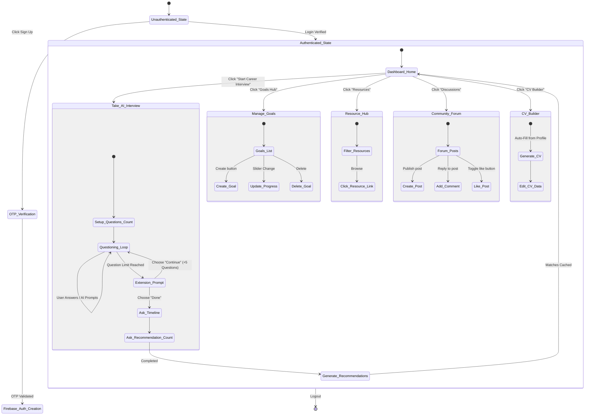

# PathFinder AI - System Design Specification & UML Reference

This document provides a highly comprehensive, production-grade description of all classes, interactions, data schemas, and design specifications required to build the logical and physical models of the **PathFinder AI** application. 

---

## 1. Class Diagram Specifications (UML Class Diagram)

Below is the exhaustive list of classes, attributes, methods, types, and their relationships representing the PathFinder AI software architecture.

### 1.1 Data Models (Entity Classes)

#### Class: `User`
* **Description:** Represents the core account details of an authenticated user.
* **Attributes:**
  * `+ uid: String` (Primary Key)
  * `+ email: String`
  * `+ name: String`
  * `+ role: UserRole` (Enum: `standard`, `expert`, `admin`)
  * `+ createdAt: Timestamp`
  * `+ lastLogin: Timestamp`
* **Relationships:**
  * `1` User has `1` `Profile` (One-to-One association)
  * `1` User has `0..*` `Goal` (One-to-Many association)
  * `1` User has `0..*` `AISession` (One-to-Many association)
  * `1` User has `0..*` `Recommendation` (One-to-Many association)
  * `1` User has `0..*` `Notification` (One-to-Many association)
  * `1` User has `0..*` `CommunityPost` (One-to-Many association)
  * `1` User has `0..*` `Comment` (One-to-Many association)
  * `1` User has `0..1` `CV` (One-to-One association)
  * `1` User has `0..1` `JobsCache` (One-to-One association)

#### Class: `Profile`
* **Description:** Contains student or career tracker demographics and system preferences.
* **Attributes:**
  * `+ userId: String` (Primary Key, Foreign Key referencing `User.uid`)
  * `+ phone: String`
  * `+ location: String`
  * `+ education: List<String>`
  * `+ skills: List<String>`
  * `+ interests: List<String>`
  * `+ careerGoals: List<String>`
  * `+ experience: String`
  * `+ language: String` (default: `'en'`)
  * `+ timezone: String` (default: `'Pacific Time (PT)'`)
  * `+ privacySettings: PrivacySettings` (Struct)
  * `+ notificationSettings: NotificationSettings` (Struct)
* **Nested Structs:**
  * `PrivacySettings`: `{ profileVisibility: Boolean, dataCollection: Boolean, shareProgress: Boolean }`
  * `NotificationSettings`: `{ emailNotifications: Boolean, goalReminders: Boolean, communityActivity: Boolean, marketingCommunications: Boolean }`

#### Class: `Goal`
* **Description:** Represents career milestones set and tracked by the user.
* **Attributes:**
  * `+ _id: String` (Primary Key)
  * `+ userId: String` (Foreign Key referencing `User.uid`)
  * `+ text: String`
  * `+ category: GoalCategory` (Enum: `Career`, `Academic`, `Skill`, `Personal`)
  * `+ priority: GoalPriority` (Enum: `low`, `medium`, `high`)
  * `+ deadline: Date`
  * `+ completed: Boolean`
  * `+ progress: Number` (Percentage value: 0 to 100)
  * `+ deadlineNotified: Boolean`
  * `+ createdAt: Timestamp`
  * `+ updatedAt: Timestamp`

#### Class: `AISession`
* **Description:** Stores historical interview chats between the user and the AI agent.
* **Attributes:**
  * `+ sessionId: String` (Primary Key)
  * `+ userId: String` (Foreign Key referencing `User.uid`)
  * `+ messages: List<MessageObject>`
  * `+ answers: List<String>`
  * `+ completed: Boolean`
  * `+ questionCount: Number`
  * `+ questionLimit: Number`
  * `+ timeline: String` (e.g., `'6 months'`)
  * `+ recommendationCount: Number`
  * `+ phase: InterviewPhase` (Enum: `setup_limit`, `questioning`, `limit_reached`, `timeline`, `rec_count`, `complete`)
  * `+ createdAt: Timestamp`
  * `+ updatedAt: Timestamp`
* **Nested Structs:**
  * `MessageObject`: `{ role: String, content: String, timestamp: Date }`

#### Class: `Recommendation`
* **Description:** Tailored career paths generated by LLMs based on user profiles.
* **Attributes:**
  * `+ recId: String` (Primary Key)
  * `+ userId: String` (Foreign Key referencing `User.uid`)
  * `+ sessionId: String` (Foreign Key referencing `AISession.sessionId`)
  * `+ recommendations: List<RecommendationItem>`
  * `+ overallSummary: String`
  * `+ recommendationCount: Number`
  * `+ createdAt: Timestamp`
* **Nested Structs:**
  * `RecommendationItem`: `{ rank: Number, title: String, reason: String, matchScore: Number, salaryRange: SalaryRange, growthRate: String, requiredSkills: List<String>, skillsGap: List<String>, roadmap: Roadmap, resources: List<ResourceItem> }`
  * `SalaryRange`: `{ min: Number, max: Number, currency: String }`
  * `Roadmap`: `{ totalDuration: String, steps: List<RoadmapStep> }`
  * `RoadmapStep`: `{ step: Number, title: String, duration: String, resources: List<String>, outcome: String }`
  * `ResourceItem`: `{ name: String, provider: String, type: String, description: String }`

#### Class: `LearningResource`
* **Description:** Reference learning materials indexed in the Resource Hub.
* **Attributes:**
  * `+ resourceId: String` (Primary Key)
  * `+ name: String`
  * `+ provider: String`
  * `+ type: ResourceType` (Enum: `Course`, `Book`, `Article`, `Tool`)
  * `+ url: String`
  * `+ topics: List<String>`
  * `+ createdAt: Timestamp`
  * `+ updatedAt: Timestamp`

#### Class: `CommunityPost`
* **Description:** User-generated discussion posts inside the community board.
* **Attributes:**
  * `+ _id: String` (Primary Key)
  * `+ userID: String` (Foreign Key referencing `User.uid`)
  * `+ title: String`
  * `+ content: String`
  * `+ date: Timestamp`
  * `+ likes_count: Number`
  * `+ comments_count: Number`
  * `+ likes: List<String>` (List of User UIDs)

#### Class: `Comment`
* **Description:** Reply strings attached to a `CommunityPost`.
* **Attributes:**
  * `+ _id: String` (Primary Key)
  * `+ postID: String` (Foreign Key referencing `CommunityPost._id`)
  * `+ userID: String` (Foreign Key referencing `User.uid`)
  * `+ text: String`
  * `+ date: Timestamp`

#### Class: `Notification`
* **Description:** System notifications pushed to the user's dashboard.
* **Attributes:**
  * `+ _id: String` (Primary Key)
  * `+ userID: String` (Foreign Key referencing `User.uid`)
  * `+ title: String`
  * `+ body: String`
  * `+ type: String` (e.g., `'goal'`, `'community'`)
  * `+ goalID: String` (Foreign Key, optional)
  * `+ commentID: String` (Foreign Key, optional)
  * `+ postID: String` (Foreign Key, optional)
  * `+ isRead: Boolean`
  * `+ createdAt: Timestamp`

#### Class: `CV`
* **Description:** AI-generated and user-editable curriculum vitae template.
* **Attributes:**
  * `+ id: String` (Primary Key)
  * `+ userId: String` (Foreign Key referencing `User.uid`)
  * `+ summary: String`
  * `+ education: List<EducationRecord>`
  * `+ experience: List<ExperienceRecord>`
  * `+ skills: List<String>`
  * `+ projects: List<ProjectRecord>`
  * `+ languages: List<String>`
  * `+ createdAt: Timestamp`
  * `+ updatedAt: Timestamp`

#### Class: `JobsCache`
* **Description:** Caches localized job listing match results for 24 hours.
* **Attributes:**
  * `+ userId: String` (Primary Key, Foreign Key referencing `User.uid`)
  * `+ jobs: List<JobListing>`
  * `+ updatedAt: Timestamp`

#### Class: `OTP`
* **Description:** Single-use verification codes stored during registration.
* **Attributes:**
  * `+ email: String` (Primary Key)
  * `+ otp: String`
  * `+ expiresAt: Number` (Epoch timestamp)
  * `+ verified: Boolean`
  * `+ verifiedAt: Number` (Epoch timestamp)
  * `+ createdAt: Timestamp`

---

### 1.2 Controllers & Service Layers (Control Classes)

#### Class: `UserController` & `UserService`
* **Description:** Manages authentication registrations, user syncs, OTP emails, profiles, and deletions.
* **Methods (`UserController`):**
  * `+ sendOTP(req, res): Promise<res>`
  * `+ verifyOTP(req, res): Promise<res>`
  * `+ registerUser(req, res): Promise<res>`
  * `+ loginUser(req, res): Promise<res>`
  * `+ getProfile(req, res): Promise<res>`
  * `+ updateProfile(req, res): Promise<res>`
  * `+ deleteAccount(req, res): Promise<res>`
  * `+ resetData(req, res): Promise<res>`
* **Methods (`UserService`):**
  * `+ registerUser(userData: Object, uid: String): Promise<Object>`
  * `+ loginUser(uid: String): Promise<Object>`
  * `+ getUserProfile(uid: String): Promise<Object>`
  * `+ updateUserProfile(uid: String, updateData: Object): Promise<Object>`
  * `+ deleteUserAccount(uid: String): Promise<Boolean>`
  * `+ resetUserData(uid: String): Promise<Boolean>`
* **Relationships:**
  * `UserController` has a dependency on `UserService` and `EmailService`.

#### Class: `GoalController` & `GoalService`
* **Description:** Handles CRUD operations for milestones.
* **Methods (`GoalController`):**
  * `+ getGoals(req, res): Promise<res>`
  * `+ getGoal(req, res): Promise<res>`
  * `+ createGoal(req, res): Promise<res>`
  * `+ updateGoal(req, res): Promise<res>`
  * `+ deleteGoal(req, res): Promise<res>`
* **Methods (`GoalService`):**
  * `+ getUserGoals(userId: String): Promise<List<Goal>>`
  * `+ getGoalById(goalId: String, userId: String): Promise<Goal>`
  * `+ createGoal(userId: String, goalData: Object): Promise<Goal>`
  * `+ updateGoal(goalId: String, userId: String, updateData: Object): Promise<Goal>`
  * `+ updateProgress(goalId: String, userId: String, progress: Number): Promise<Goal>`
  * `+ deleteGoal(goalId: String, userId: String): Promise<Boolean>`

#### Class: `InterviewController` & `InterviewService`
* **Description:** Orchestrates the multi-phase AI career guidance interview.
* **Methods (`InterviewController`):**
  * `+ startSession(req, res): Promise<res>`
  * `+ processMessage(req, res): Promise<res>`
  * `+ getSession(req, res): Promise<res>`
  * `+ getUserSessions(req, res): Promise<res>`
  * `+ deleteSession(req, res): Promise<res>`
* **Methods (`InterviewService`):**
  * `+ startSession(userId: String, language: String): Promise<Object>`
  * `+ processMessage(userId: String, sessionId: String, userMessage: String): Promise<Object>`
  * `+ getSession(sessionId: String, userId: String): Promise<AISession>`
  * `+ getUserSessions(userId: String): Promise<List<AISession>>`
  * `+ deleteSession(sessionId: String, userId: String): Promise<Boolean>`
* **Relationships:**
  * `InterviewService` depends on `AiProviderClient` and `UserService`.

#### Class: `RecommendationController` & `RecommendationService`
* **Description:** Generates ranked lists of recommendations with detailed roadmap steps.
* **Methods (`RecommendationController`):**
  * `+ generateRecommendation(req, res): Promise<res>`
  * `+ getRecommendations(req, res): Promise<res>`
  * `+ clearRecommendations(req, res): Promise<res>`
  * `+ deleteRecommendationEntry(req, res): Promise<res>`
  * `+ saveRecommendation(req, res): Promise<res>`
  * `+ getRecommendation(req, res): Promise<res>`
* **Methods (`RecommendationService`):**
  * `+ generateRecommendation(userId: String, sessionId: String): Promise<Recommendation>`
  * `+ saveRecommendation(userId: String, data: Object): Promise<Recommendation>`
  * `+ getUserRecommendations(userId: String): Promise<List<Recommendation>>`
  * `+ clearRecommendations(userId: String): Promise<Number>`
  * `+ getRecommendationById(id: String, userId: String): Promise<Recommendation>`
  * `+ deleteRecommendationEntry(docId: String, entryIndex: Number, userId: String): Promise<Boolean>`
* **Relationships:**
  * `RecommendationService` depends on `AiProviderClient`.

#### Class: `ResourceController` & `ResourceService`
* **Description:** Indexes learning resources in the system database.
* **Methods (`ResourceController`):**
  * `+ getResources(req, res): Promise<res>`
  * `+ getResource(req, res): Promise<res>`
  * `+ createResource(req, res): Promise<res>`
  * `+ updateResource(req, res): Promise<res>`
  * `+ deleteResource(req, res): Promise<res>`
* **Methods (`ResourceService`):**
  * `+ getAllResources(queryParams: Object): Promise<List<LearningResource>>`
  * `+ getResourceById(id: String): Promise<LearningResource>`
  * `+ createResource(data: Object): Promise<LearningResource>`
  * `+ updateResource(id: String, data: Object): Promise<LearningResource>`
  * `+ deleteResource(id: String): Promise<Boolean>`

#### Class: `CommunityController` & `CommunityService`
* **Description:** Manages message boards, likes, notifications, and comments.
* **Methods (`CommunityController`):**
  * `+ getPosts(req, res): Promise<res>`
  * `+ getPost(req, res): Promise<res>`
  * `+ createPost(req, res): Promise<res>`
  * `+ updatePost(req, res): Promise<res>`
  * `+ deletePost(req, res): Promise<res>`
  * `+ likePost(req, res): Promise<res>`
  * `+ addComment(req, res): Promise<res>`
  * `+ deleteComment(req, res): Promise<res>`
* **Methods (`CommunityService`):**
  * `+ getAllPosts(queryParams: Object): Promise<List<CommunityPost>>`
  * `+ getPostById(postId: String): Promise<CommunityPost>`
  * `+ createPost(userId: String, postData: Object): Promise<CommunityPost>`
  * `+ updatePost(postId: String, userId: String, updateData: Object): Promise<CommunityPost>`
  * `+ deletePost(postId: String, userId: String): Promise<Boolean>`
  * `+ likePost(postId: String, userId: String): Promise<CommunityPost>`
  * `+ addComment(postId: String, userId: String, text: String): Promise<Comment>`
  * `+ getCommentsForPost(postId: String): Promise<List<Comment>>`
  * `+ deleteComment(postId: String, commentId: String, userId: String): Promise<Boolean>`
* **Relationships:**
  * `CommunityService` depends on `NotificationService`.

#### Class: `NotificationController` & `NotificationService`
* **Description:** CRUD manager for notifications.
* **Methods (`NotificationController`):**
  * `+ getNotifications(req, res): Promise<res>`
  * `+ markAsRead(req, res): Promise<res>`
  * `+ deleteNotification(req, res): Promise<res>`
  * `+ markAllAsRead(req, res): Promise<res>`
  * `+ deleteAllNotifications(req, res): Promise<res>`
* **Methods (`NotificationService`):**
  * `+ getUserNotifications(userId: String): Promise<List<Notification>>`
  * `+ createNotification(userId: String, title: String, body: String, type: String, goalID: String, commentID: String, postID: String): Promise<Notification>`
  * `+ markAsRead(notificationId: String, userId: String): Promise<Notification>`
  * `+ deleteNotification(notificationId: String, userId: String): Promise<Boolean>`
  * `+ markAllAsRead(userId: String): Promise<Boolean>`
  * `+ deleteAllNotifications(userId: String): Promise<Boolean>`

#### Class: `CVController` & `CVService`
* **Description:** Triggers resume summaries and structures them via templates.
* **Methods (`CVController`):**
  * `+ generateCV(req, res): Promise<res>`
  * `+ getCV(req, res): Promise<res>`
  * `+ updateCV(req, res): Promise<res>`
  * `+ deleteCV(req, res): Promise<res>`
* **Methods (`CVService`):**
  * `+ generateCV(userId: String): Promise<CV>`
  * `+ getUserCV(userId: String): Promise<CV>`
  * `+ updateCV(userId: String, data: Object): Promise<CV>`
  * `+ deleteCV(userId: String): Promise<Boolean>`

#### Class: `JobsController` & `JobsService`
* **Description:** Pulls relevant jobs matching career paths from a dynamic Jordan-focused AI listing.
* **Methods (`JobsController`):**
  * `+ getJobs(req, res): Promise<res>`
* **Methods (`JobsService`):**
  * `+ getLocalizedJobs(userId: String, forceRefresh: Boolean): Promise<List<JobListing>>`

#### Class: `EmailService` (Utility)
* **Description:** Integrates with Brevo REST SMTP API to send OTP emails.
* **Methods:**
  * `+ sendOTPEmail(email: String, otp: String): Promise<Boolean>`

#### Class: `AiProviderClient` (Utility)
* **Description:** Invokes LLMs (Groq, Cerebras, OpenRouter) with retry-backoff algorithms.
* **Methods:**
  * `+ generateAIResponse(prompt: String, options: Object): Promise<String>`

#### Class: `DeadlineWorker` (Utility/Background Worker)
* **Description:** Scheduled cron interval loops checking for imminent deadlines.
* **Methods:**
  * `+ checkDeadlines(): Promise<void>`
  * `+ startDeadlineWorker(): void`

---

## 2. Sequence Diagram Traces (Logical Flows)

The following traces outline the interactions between actors, boundary interfaces, control services, and entity databases for each sequence diagram.

### Figure 4.3: Sign Up Sequence Diagram
1. **User UI (Signup.jsx)** inputs email address and clicks "Send OTP".
2. **Signup.jsx** sends `POST /api/users/otp/send { email }` to **UserRouter**.
3. **UserRouter** routes request to **UserController.sendOTP()**.
4. **UserController** queries **Firebase Admin Auth SDK** using `.getUserByEmail(email)` to verify if the email is already registered.
5. If user exists, **UserController** returns `400 Bad Request` ("This email is already registered").
6. If user does not exist, **UserController** generates a 6-digit OTP code, sets `expiresAt = now + 15m`.
7. **UserController** stores OTP details to **Firestore Collection `otps`** (Document ID = Email, `verified = false`).
8. **UserController** calls **EmailService.sendOTPEmail(email, otp)**.
9. **EmailService** issues a secure `POST` request containing API headers and HTML templates to **Brevo API**.
10. **Brevo API** responds with `201 Created`.
11. **UserController** responds to **Signup.jsx** with `200 OK` ("Verification code sent successfully").
12. **Signup.jsx** shows OTP input view. User inputs OTP, clicks "Verify".
13. **Signup.jsx** sends `POST /api/users/otp/verify { email, otp }` to **UserRouter**.
14. **UserRouter** routes request to **UserController.verifyOTP()**.
15. **UserController** retrieves OTP document from **Firestore Collection `otps`** by email.
16. **UserController** verifies code matching and expiration:
    * If mismatch or expired, returns `400 Bad Request`.
    * If valid, updates **Firestore Collection `otps`** document field `verified = true`, `verifiedAt = Date.now()`.
17. **UserController** responds to **Signup.jsx** with `200 OK` ("Email verified successfully").
18. **Signup.jsx** triggers Firebase Client SDK method `createUserWithEmailAndPassword(auth, email, password)`.
19. **Firebase Auth** creates account credentials, registers session, and returns User Record (containing UID).
20. **Signup.jsx** sends `POST /api/users/register { name, email }` with the Bearer authorization token.
21. **Protect Middleware** decodes the Bearer token, assigns `req.user = decodedToken`, and passes to **UserController.registerUser()**.
22. **UserController** calls **UserService.registerUser(userData, uid)**.
23. **UserService** queries **Firestore Collection `otps`** to verify OTP `verified` status is `true` and was checked in the last 15 minutes.
24. **UserService** creates user document in **Firestore `users`** collection (Doc ID = UID) and profile document in **Firestore `profiles`** collection (Doc ID = UID, default fields).
25. **UserService** returns registration data to **UserController**.
26. **UserController** responds with `201 Created`.
27. **Signup.jsx** redirects user to the Dashboard.

### Figure 4.4: Login Sequence Diagram
1. **User UI (Login.jsx)** inputs email and password, clicks "Login".
2. **Login.jsx** calls **Firebase Auth Client SDK** `signInWithEmailAndPassword(auth, email, password)`.
3. **Firebase Auth** authenticates credentials and returns **Firebase ID Token**.
4. **Login.jsx** issues `POST /api/users/login` with token in header `Authorization: Bearer <token>`.
5. **Protect Middleware** catches request, decodes token via Firebase Admin, checks Firestore user doc existence, sets `req.user`, and calls **UserController.loginUser()**.
6. **UserController** calls **UserService.loginUser(uid)**.
7. **UserService** updates `lastLogin` timestamp in **Firestore `users`** collection (Doc ID = UID).
8. **UserService** retrieves the user document and returns it.
9. **UserController** sends `200 OK` with user profile payload to **Login.jsx**.
10. **Login.jsx** updates **AuthContext** state, configures defaults, and redirects to Dashboard.

### Figure 4.5: Edit Profile Sequence Diagram
1. **User UI (Profile.jsx)** modifies profile attributes (skills, location, phone, education) and clicks "Save".
2. **Profile.jsx** sends `PATCH /api/users/profile` containing changes in payload and the Bearer token.
3. **Protect Middleware** verifies token, sets `req.user`, and redirects to **UserController.updateProfile()**.
4. **UserController** calls **UserService.updateUserProfile(uid, req.body)**.
5. **UserService** splits parameters:
    * Updates account fields (`name`, `email`) in **Firestore `users`** collection.
    * Updates detail fields (skills, education, location) in **Firestore `profiles`** collection.
6. **UserService** gets the updated documents, normalizes settings, and returns profile payload.
7. **UserController** responds with `200 OK`.
8. **Profile.jsx** updates profile state in **AuthContext** and displays success banner.

### Figure 4.6: Take AI Interview Sequence Diagram
1. **User UI (Interview.jsx)** clicks "Start Interview" (choosing interface language).
2. **Interview.jsx** sends `POST /api/interview/start { language }`.
3. **Protect Middleware** verifies token, sets `req.user`, routes to **InterviewController.startSession()**.
4. **InterviewController** calls **InterviewService.startSession(userId, language)**.
5. **InterviewService** creates a session document in **Firestore `interview_sessions`** collection:
    * Sets `messages = [{ role: 'assistant', content: 'Welcome...' }]`
    * Sets `phase = 'setup_limit'`, `completed = false`.
6. **InterviewService** returns sessionId and initial question.
7. **InterviewController** sends `200 OK` to **Interview.jsx**.
8. *Looping Interview Chat Phase:*
    * **User** inputs message, clicks send.
    * **Interview.jsx** sends `POST /api/interview/chat { sessionId, message }`.
    * **Protect Middleware** decodes token, routes to **InterviewController.processMessage()**.
    * **InterviewController** calls **InterviewService.processMessage(userId, sessionId, userMessage)**.
    * **InterviewService** retrieves session document from **Firestore `interview_sessions`**.
    * **InterviewService** sanitizes user input and pushes message to history logs.
    * **InterviewService** checks `session.phase`:
        * *If `setup_limit`:* Parses requested question count, updates `questionLimit` (clamped 5..20) and transitions `phase = 'questioning'`. Invokes **AiProviderClient.generateAIResponse(prompt)** using Groq/OpenRouter. Parses AI question JSON response, saves to history, returns next question.
        * *If `questioning`:* Appends response. If `questionCount >= questionLimit`, updates `phase = 'limit_reached'`, returns option questions ("done" or "continue"). Else, increments `questionCount`, requests next question from **AiProviderClient**, updates history, returns next question.
        * *If `limit_reached`:* If user continues, adds 5 questions, resets `phase = 'questioning'`. If user selects done, updates `phase = 'timeline'`, requests timeline duration.
        * *If `timeline`:* Saves timeline duration (e.g. 6 months), transitions `phase = 'rec_count'`, requests recommendation count.
        * *If `rec_count`:* Parses choice (1..5), sets `completed = true`, `phase = 'complete'`, returns completion status.
    * **InterviewService** saves session updates to **Firestore**.
    * **InterviewController** returns chat details to **Interview.jsx**.
9. **Interview.jsx** triggers career matchmaking once `complete = true` is received.

### Figure 4.7: View Career Match Sequence Diagram
1. **User UI (CareerPaths.jsx)** calls `POST /api/recommendations { sessionId }` to obtain matches.
2. **Protect Middleware** decodes token, passes to **RecommendationController.generateRecommendation()**.
3. **RecommendationController** calls **RecommendationService.generateRecommendation(userId, sessionId)**.
4. **RecommendationService** retrieves matching session document from **Firestore `interview_sessions`** and profile from **Firestore `profiles`**.
5. **RecommendationService** constructs tailored prompts detailing the user's skills, experience, and interview history.
6. **RecommendationService** calls **AiProviderClient.generateAIResponse(prompt, options)**.
7. **AiProviderClient** forwards request to **Groq API** (`llama-3.3-70b-versatile` model).
8. If Groq API rate limits (HTTP 429) or fails (HTTP 5xx), **AiProviderClient** retries up to 2 times, then falls back to **Cerebras** or **OpenRouter** (`google/gemini-2.5-flash` model).
9. **AiProviderClient** returns raw JSON string back to **RecommendationService**.
10. **RecommendationService** parses JSON, normalizes ranks, filters items based on `recommendationCount`, and maps details (salary in JOD, growth rates, required skills, learning roadmaps).
11. **RecommendationService** saves results to **Firestore `recommendations`** collection.
12. **RecommendationService** returns matches payload.
13. **RecommendationController** returns `201 Created` with results.
14. **CareerPaths.jsx** updates dashboard layout displaying matches.

### Figure 4.8: Generate Learning Roadmap Sequence Diagram
1. **User UI (CareerPaths.jsx)** selects a career recommendation card.
2. **CareerPaths.jsx** parses the recommendation object attributes:
    * `recommendation.roadmap.totalDuration` (e.g., "6 months")
    * `recommendation.roadmap.steps` (Array of objects detailing step, title, duration, outcome, and resources).
3. If not cached, **CareerPaths.jsx** sends `GET /api/recommendations/:id` to fetch the roadmap.
4. **Protect Middleware** decodes token, routes to **RecommendationController.getRecommendation()**.
5. **RecommendationController** calls **RecommendationService.getRecommendationById(id, userId)**.
6. **RecommendationService** gets the document from **Firestore `recommendations`** collection and returns it.
7. **RecommendationController** returns `200 OK`.
8. **CareerPaths.jsx** processes the roadmap array and renders a vertical, interactive stepper timeline displaying milestones, required course resources, and target outcomes.
9. User clicks "Add to my goals" on a roadmap step.
10. **CareerPaths.jsx** sends `POST /api/goals` to create a goal matching the roadmap step.

### Figure 4.9: Rate Recommendation Sequence Diagram
1. **User UI (CareerPaths.jsx)** clicks to remove/delete a specific career path.
2. **CareerPaths.jsx** sends `DELETE /api/recommendations/:docId/entry/:index`.
3. **Protect Middleware** validates token, routes to **RecommendationController.deleteRecommendationEntry()**.
4. **RecommendationController** calls **RecommendationService.deleteRecommendationEntry(docId, index, userId)**.
5. **RecommendationService** retrieves document reference from **Firestore `recommendations`** collection.
6. **RecommendationService** verifies that `userId` matches the requester UID.
7. **RecommendationService** splices out the recommendation item matching the specified index.
    * If no recommendations remain in the document, **RecommendationService** calls `.delete()` to purge the document.
    * If recommendations remain, updates the document array field in Firestore.
8. **RecommendationService** returns success status.
9. **RecommendationController** responds with `200 OK`.
10. **CareerPaths.jsx** updates state and removes path card from view.

### Figure 4.10: Create Forum Post Sequence Diagram
1. **User UI (Community.jsx)** fills in post content (title, tags, body) and clicks "Publish".
2. **Community.jsx** sends `POST /api/community/posts` with payload and Bearer token.
3. **Protect Middleware** verifies token, sets `req.user`, routes to **CommunityController.createPost()**.
4. **CommunityController** calls **CommunityService.createPost(userId, postData)**.
5. **CommunityService** writes post object to **Firestore Collection `community`** (Document ID is auto-generated; `likes_count = 0`, `comments_count = 0`).
6. **CommunityService** retrieves new post details and returns them.
7. **CommunityController** responds to **Community.jsx`** with `201 Created`.
8. **Community.jsx** appends new post to top of discussion board feed.

### Figure 4.11: Comment on Post Sequence Diagram
1. **User UI (Community.jsx)** writes reply text in a comment form and clicks "Send".
2. **Community.jsx** sends `POST /api/community/posts/:id/comments { text }`.
3. **Protect Middleware** validates token, routes request to **CommunityController.addComment()**.
4. **CommunityController** calls **CommunityService.addComment(postId, userId, text)**.
5. **CommunityService** creates comment document in **Firestore Collection `comments`** (storing `postID`, `userID`, `text`, `date`).
6. **CommunityService** updates the matching post document in **Firestore Collection `community`** (Doc ID = postID) by incrementing `comments_count` by 1.
7. **CommunityService** queries post details to identify original post owner's UID.
8. If commenter is not post owner, **CommunityService** calls **NotificationService.createNotification(postOwnerId, title, body, type, ...)**.
9. **NotificationService** adds alert document to **Firestore Collection `notifications`**.
10. **CommunityService** returns comment details.
11. **CommunityController** sends `200 OK` (or `201 Created`) with comment to **Community.jsx**.
12. **Community.jsx** renders comment inside post comment section.

### Figure 4.12: Search Resources Sequence Diagram
1. **User UI (ResourceHub.jsx)** inputs search string, filters by type or topic.
2. **ResourceHub.jsx** sends `GET /api/resources?search=...&type=...&topic=...`.
3. **Protect Middleware** verifies token, routes to **ResourceController.getResources()**.
4. **ResourceController** calls **ResourceService.getAllResources(queryParams)**.
5. **ResourceService** checks search filters:
    * If text query exists: Fetches all resources from **Firestore Collection `learning_resources`**, filters in memory for case-insensitive matches against name, provider, or topics.
    * If only type/topic parameters: Queries **Firestore** using `.where('type', '==', type)` or `.where('topics', 'array-contains', topic)`.
6. **ResourceService** sorts results by `createdAt` descending and returns list.
7. **ResourceController** responds to **ResourceHub.jsx** with `200 OK`.
8. **ResourceHub.jsx** displays matching resource grids.

### Figure 4.13: Forgot Password Sequence Diagram
1. **User UI (Login.jsx / Reset Password Modal)** inputs registered email address, clicks "Send Reset Link".
2. **Login.jsx** calls Firebase Auth client method `sendPasswordResetEmail(auth, email)`.
3. **Firebase Auth Servers** intercept request, look up email validity, and generate a secure reset token link.
4. **Firebase Auth Servers** email the reset password link to user email address.
5. **Firebase Auth Client SDK** resolves promise and returns success flag.
6. **Login.jsx** displays alert message: "Check your email for reset instructions."

### Figure 4.14: Logout Sequence Diagram
1. **User UI (Navbar / Dashboard)** clicks "Logout".
2. **Navbar** calls logout handler in **AuthContext.jsx**.
3. **AuthContext.jsx** triggers Firebase Client SDK method `signOut(auth)`.
4. **Firebase Auth** destroys token session and clears client authentication flags.
5. **AuthContext.jsx** listener `onAuthStateChanged` fires:
    * Sets state user = null.
    * Clears local states for profile, goals, recommendations, and notifications.
6. **Navbar** redirects the user to the public landing index screen (`/`).

### Figure 4.15: Expert Answer Question Sequence Diagram
1. **Expert UI (Community.jsx)** reviews posts under "Unanswered", inputs professional feedback, clicks "Publish Answer".
2. **Community.jsx** sends `POST /api/community/posts/:id/comments { text }` containing Bearer token.
3. **Protect Middleware** decodes token, confirms user UID, and verifies that `users` record has `role == 'expert'` (or 'expert' string). Routes request to **CommunityController.addComment()**.
4. **CommunityController** calls **CommunityService.addComment(postId, expertId, text)**.
5. **CommunityService** adds comment to **Firestore Collection `comments`** (indicating expert UID).
6. **CommunityService** updates **Firestore Collection `community`** post document, incrementing `comments_count`.
7. **CommunityService** fetches original poster's UID from the post document.
8. **CommunityService** calls **NotificationService.createNotification(posterUid, 'Expert Answer Received', 'Expert [Name] answered your question', 'community', ...)**.
9. **NotificationService** saves notification in **Firestore Collection `notifications`**.
10. **CommunityService** returns comment details.
11. **CommunityController** responds with `200 OK`.
12. **Community.jsx** displays comment marked with a styled "Career Expert" badge.

### Figure 4.16: Admin Add Expert Sequence Diagram
1. **Admin Dashboard UI** inputs name, email, password, and selects Role = "Expert", clicks "Add User".
2. **Admin UI** sends `POST /api/admin/users/expert { name, email, password }` with Admin Bearer token.
3. **Protect Middleware** verifies token, assigns `req.user`.
4. **Authorize Middleware** `authorize('Admin')` checks that `req.user.role` is `'admin'`.
5. Request is routed to **AdminUserController.createExpert()**.
6. **AdminUserController** calls Firebase Admin Auth SDK `admin.auth().createUser({ email, password, displayName })`.
7. **Firebase Auth** registers account credentials and returns the new expert UID.
8. **AdminUserController** creates user document in **Firestore `users`** collection:
    * Sets `uid = expertUid`, `email`, `name`, `role = 'expert'`, `createdAt = serverTimestamp()`.
9. **AdminUserController** initializes default profile details in **Firestore `profiles`** collection.
10. **AdminUserController** responds with `201 Created` to Admin Dashboard.
11. **Admin Dashboard UI** displays success notification.

### Figure 4.17: Admin View Analytics Sequence Diagram
1. **Admin Dashboard UI** navigates to Analytics tab.
2. **Admin Dashboard UI** sends `GET /api/admin/analytics`.
3. **Protect & Authorize Middleware** verify token validity and Admin roles, routing to **AdminController.getAnalytics()**.
4. **AdminController** calls **AnalyticsService.computeSystemMetrics()**.
5. **AnalyticsService** executes aggregate counts queries on **Firestore collections**:
    * Total users count from `users` where `role == 'standard'`.
    * Total experts count from `users` where `role == 'expert'`.
    * Total goals completed vs pending from `goals`.
    * Total sessions completed from `interview_sessions`.
    * Recent feedback queries from `feedback` (or feedback collection).
6. **AnalyticsService** returns computed analytics payload.
7. **AdminController** responds with `200 OK` containing statistics.
8. **Admin Dashboard UI** renders metric grids, bar charts, and growth rate numbers.

---

## 3. Logical Design Diagrams (Context & Structure)

This section provides the semantic data and structural definitions required to map system models to specific UML visuals.

### 3.1 Use Case Diagram Definitions
* **Actors:**
  * **Regular User:** A student or job-seeker. Interacts with authentication, interview sessions, goals, CV builders, localized jobs, resources, and community forums.
  * **Career Expert:** A verified professional advisor. Interacts with forums to answer questions and manages educational materials in the Resource Hub.
  * **Admin:** System manager. Moderates boards, registers experts, updates learning resource files, audits analytics, and resets user profiles.
* **Actor Relationships:**
  * **Regular User** and **Career Expert** inherit from a common **Authenticated User** class.
  * **Admin** maintains absolute access over all system functions.
* **Use Case Assignments:**
  * Refer to the boundaries outlined in **Use Case Diagram 4.1** (User/Expert) and **Use Case Diagram 4.2** (Admin).

---

### 3.2 Activity Diagrams (Workflow Modeling)



---

### 3.3 Entity Relationship Diagram (ERD)

```mermaid
erDiagram
    USER ||--|| PROFILE : "has profile"
    USER ||--o{ GOAL : "tracks goals"
    USER ||--o{ AI_SESSION : "conducts interviews"
    USER ||--o{ RECOMMENDATION : "receives matches"
    USER ||--o{ COMMUNITY_POST : "publishes posts"
    USER ||--o{ COMMENT : "writes replies"
    USER ||--o{ NOTIFICATION : "receives alerts"
    USER ||--o| CV : "builds resume"
    USER ||--o| JOBS_CACHE : "caches listings"

    USER {
        string uid PK
        string email
        string name
        string role
        timestamp createdAt
        timestamp lastLogin
    }

    PROFILE {
        string userId PK, FK
        string phone
        string location
        string experience
        string language
        string timezone
        array education
        array skills
        array interests
        array careerGoals
        object privacySettings
        object notificationSettings
    }

    GOAL {
        string id PK
        string userId FK
        string text
        string category
        string priority
        date deadline
        boolean completed
        number progress
        boolean deadlineNotified
        timestamp createdAt
        timestamp updatedAt
    }

    AI_SESSION {
        string sessionId PK
        string userId FK
        array messages
        array answers
        boolean completed
        number questionCount
        number questionLimit
        string timeline
        number recommendationCount
        string phase
        timestamp createdAt
        timestamp updatedAt
    }

    RECOMMENDATION {
        string recId PK
        string userId FK
        string sessionId FK
        array recommendations
        string overallSummary
        number recommendationCount
        timestamp createdAt
    }

    COMMUNITY_POST {
        string id PK
        string userID FK
        string title
        string content
        timestamp date
        number likes_count
        number comments_count
        array likes
    }

    COMMENT {
        string id PK
        string postID FK
        string userID FK
        string text
        timestamp date
    }

    NOTIFICATION {
        string id PK
        string userID FK
        string title
        string body
        string type
        string goalID FK
        string commentID FK
        string postID FK
        boolean isRead
        timestamp createdAt
    }

    CV {
        string id PK
        string userId FK
        string summary
        array education
        array experience
        array skills
        array projects
        array languages
        timestamp createdAt
        timestamp updatedAt
    }

    JOBS_CACHE {
        string userId PK, FK
        array jobs
        timestamp updatedAt
    }
```



---

### 3.4 Database Schema (Firestore Collections Structure)

Firestore is structured as a NoSQL document database. Subcollections or document attributes represent relational joins.

#### Collection: `users`
* Document ID = User UID (from Firebase Auth)
* Schema fields:
  ```json
  {
    "uid": "String (UID)",
    "email": "String",
    "name": "String",
    "role": "String ('standard' | 'expert' | 'admin')",
    "createdAt": "ServerTimestamp",
    "lastLogin": "ServerTimestamp",
    "updatedAt": "ServerTimestamp"
  }
  ```

#### Collection: `profiles`
* Document ID = User UID
* Schema fields:
  ```json
  {
    "userId": "String (UID)",
    "phone": "String",
    "location": "String",
    "experience": "String",
    "language": "String (e.g. 'en' | 'ar')",
    "timezone": "String",
    "education": ["String"],
    "skills": ["String"],
    "interests": ["String"],
    "careerGoals": ["String"],
    "privacySettings": {
      "profileVisibility": "Boolean",
      "dataCollection": "Boolean",
      "shareProgress": "Boolean"
    },
    "notificationSettings": {
      "emailNotifications": "Boolean",
      "goalReminders": "Boolean",
      "communityActivity": "Boolean",
      "marketingCommunications": "Boolean"
    },
    "updatedAt": "ServerTimestamp"
  }
  ```

#### Collection: `goals`
* Document ID = Auto-Generated UUID
* Schema fields:
  ```json
  {
    "userId": "String (UID)",
    "text": "String",
    "category": "String ('Career' | 'Academic' | 'Skill' | 'Personal')",
    "priority": "String ('low' | 'medium' | 'high')",
    "deadline": "String (YYYY-MM-DD or ISO)",
    "completed": "Boolean",
    "progress": "Number (0 to 100)",
    "deadlineNotified": "Boolean",
    "createdAt": "ServerTimestamp",
    "updatedAt": "ServerTimestamp"
  }
  ```

#### Collection: `interview_sessions`
* Document ID = Auto-Generated UUID
* Schema fields:
  ```json
  {
    "userId": "String (UID)",
    "messages": [
      {
        "role": "String ('user' | 'assistant')",
        "content": "String",
        "timestamp": "Date"
      }
    ],
    "answers": ["String"],
    "completed": "Boolean",
    "questionCount": "Number",
    "questionLimit": "Number",
    "timeline": "String",
    "recommendationCount": "Number",
    "phase": "String ('setup_limit' | 'questioning' | 'limit_reached' | 'timeline' | 'rec_count' | 'complete')",
    "createdAt": "ServerTimestamp",
    "updatedAt": "ServerTimestamp"
  }
  ```

#### Collection: `recommendations`
* Document ID = Auto-Generated UUID
* Schema fields:
  ```json
  {
    "userId": "String (UID)",
    "userID": "String (UID)",
    "sessionId": "String (UUID)",
    "overallSummary": "String",
    "recommendationCount": "Number",
    "createdAt": "ServerTimestamp",
    "recommendations": [
      {
        "rank": "Number",
        "title": "String",
        "reason": "String",
        "matchScore": "Number",
        "growthRate": "String",
        "salaryRange": {
          "min": "Number",
          "max": "Number",
          "currency": "String ('JOD')"
        },
        "requiredSkills": ["String"],
        "skillsGap": ["String"],
        "roadmap": {
          "totalDuration": "String",
          "steps": [
            {
              "step": "Number",
              "title": "String",
              "duration": "String",
              "outcome": "String",
              "resources": ["String"]
            }
          ]
        },
        "resources": [
          {
            "name": "String",
            "provider": "String",
            "type": "String",
            "description": "String"
          }
        ]
      }
    ]
  }
  ```

#### Collection: `community`
* Document ID = Auto-Generated UUID
* Schema fields:
  ```json
  {
    "userID": "String (UID)",
    "title": "String",
    "content": "String",
    "date": "ServerTimestamp",
    "likes_count": "Number",
    "comments_count": "Number",
    "likes": ["String (UID)"]
  }
  ```

#### Collection: `comments`
* Document ID = Auto-Generated UUID
* Schema fields:
  ```json
  {
    "postID": "String (UUID)",
    "userID": "String (UID)",
    "text": "String",
    "date": "ServerTimestamp"
  }
  ```

#### Collection: `notifications`
* Document ID = Auto-Generated UUID
* Schema fields:
  ```json
  {
    "userID": "String (UID)",
    "title": "String",
    "body": "String",
    "type": "String ('goal' | 'community')",
    "goalID": "String (UUID) | null",
    "commentID": "String (UUID) | null",
    "postID": "String (UUID) | null",
    "isRead": "Boolean",
    "createdAt": "ServerTimestamp"
  }
  ```

#### Collection: `learning_resources`
* Document ID = Auto-Generated UUID
* Schema fields:
  ```json
  {
    "name": "String",
    "provider": "String",
    "type": "String ('Course' | 'Book' | 'Article' | 'Tool')",
    "url": "String",
    "topics": ["String"],
    "createdAt": "ServerTimestamp",
    "updatedAt": "ServerTimestamp"
  }
  ```

#### Collection: `cvs`
* Document ID = Auto-Generated UUID
* Schema fields:
  ```json
  {
    "userId": "String (UID)",
    "summary": "String",
    "skills": ["String"],
    "languages": ["String"],
    "education": [
      {
        "degree": "String",
        "school": "String",
        "year": "String"
      }
    ],
    "experience": [
      {
        "position": "String",
        "company": "String",
        "duration": "String",
        "responsibilities": ["String"]
      }
    ],
    "projects": [
      {
        "name": "String",
        "description": "String",
        "technologies": ["String"]
      }
    ],
    "createdAt": "ServerTimestamp",
    "updatedAt": "ServerTimestamp"
  }
  ```

#### Collection: `jobs`
* Document ID = User UID
* Schema fields:
  ```json
  {
    "userId": "String (UID)",
    "updatedAt": "ServerTimestamp",
    "jobs": [
      {
        "id": "String (e.g. 'job-101')",
        "title": "String",
        "company": "String",
        "location": "String",
        "type": "String ('Full-time' | 'Part-time' | 'Contract' | 'Remote')",
        "experience": "String ('Entry Level' | 'Mid-Level' | 'Senior' | 'Lead')",
        "salary": "String",
        "posted": "String",
        "description": "String",
        "requirements": ["String"],
        "benefits": ["String"],
        "logo": "String (Emoji string)",
        "matchScore": "Number (0 to 100)"
      }
    ]
  }
  ```

#### Collection: `otps`
* Document ID = Email address
* Schema fields:
  ```json
  {
    "email": "String",
    "otp": "String",
    "expiresAt": "Number (Epoch timestamp)",
    "verified": "Boolean",
    "verifiedAt": "Number (Epoch timestamp)",
    "createdAt": "ServerTimestamp"
  }
  ```

---

## 4. Physical Design Specification

The following specifications detail the technology stack selection, operating systems support, and environment configurations of the deployed system.

### Table 4.5: Physical Design

| Purpose | Specifications | Technical Details / Dependencies |
| :--- | :--- | :--- |
| **Frontend Language** | JavaScript/TypeScript | Written in ECMAScript 6+ standard React syntax. Supports type checking in build stages. |
| **Frontend Framework** | React (Vite) | Bundled via Vite 6. Features hot module replacement (HMR), tree-shaking, and lazy loading routing modules. |
| **Styling** | Tailwind CSS + index.css | Utility-first Tailwind CSS combined with keyframe-animated, slow-shifting gradients (`premium-gradient`), glassmorphic panels, and RTL layout adapters. |
| **Backend Runtime** | Node.js | Event-driven, non-blocking I/O model running on V8 engine (Node v20 LTS). |
| **Backend Framework** | Express.js | Asynchronous request routers, CORS support, built-in body-parser, and global centralized error handling middleware. |
| **AI Integration** | OpenRouter & Groq APIs | API orchestrator executing prompts through Groq `llama-3.3-70b-versatile` client and OpenRouter `google/gemini-2.5-flash` client. Includes backoff fallback and retry loops. |
| **Database** | Firebase Firestore | NoSQL document collection stores. Real-time updates, atomic transactions, and composite database indices configuration. |
| **Authentication** | Firebase Auth | Client-side authorization state listeners synchronized with backend verify ID tokens headers validation middleware. |
| **Frontend Hosting** | Vercel | Static Web Hosting platform with CI/CD GitHub triggers, automatic SSL certificate provisioning, and global edge cache delivery. |
| **Backend Hosting** | Render | Managed Web Service Container hosting Node.js server. Setup with health check queries checking endpoint availability. |
| **Version Control** | GitHub | Git repository hosting workspace with main branch safety rules, PR validation checklists, and issue logs tracking. |
| **IDE** | Visual Studio Code | Customized with ESLint rules, Prettier styles formatting, and Firebase rules autocomplete helpers. |
| **Operating Systems** | Windows, macOS, Linux, iOS, Android (web) | Responsive layouts (via Tailwind grids) supporting Chrome, Safari, Firefox, and Edge browsers across mobile, desktop, and tablets. |
